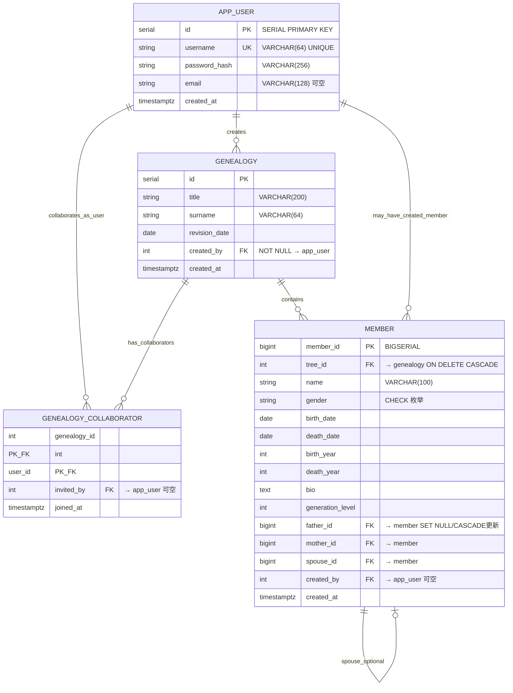

# 「寻根溯源」数据库设计说明

本文档描述 Web 应用 **寻根溯源** 所依赖的 PostgreSQL **概念结构、逻辑模式、完整性约束与物理索引**，并与仓库中 `sql/`、`models.py`、`app.py` 的当前实现对齐。**婚配不设独立 `marriage` 表**，配偶关系由 `member.spouse_id` 互指表达；请勿与旧版含 `marriage` 的草稿图混淆。

---

## 1. 环境与技术栈

| 项目 | 说明 |
|------|------|
| RDBMS | **PostgreSQL**（建议实测 `SELECT version();`） |
| 初始化顺序 | `sql/00_reset_before_reimport.sql`（慎用）→ `sql/01_schema.sql` → `sql/02_indexes.sql` → 按需执行编号迁移脚本 |
| ORM | SQLAlchemy 2.x：`models.py` 与 DDL 对齐 |
| 应用 | Flask：`app.py` 内表单校验、部分嵌入 SQL |

---

## 2. ER 图（概念层，Mermaid）



---

## 3. 联系类型与建模取舍

| 联系 | 基数 | 实现方式 |
|------|------|-----------|
| 用户 → 族谱（创建） | **1 : N** | `genealogy.created_by` → `app_user(id)` |
| 用户 ⇄ 族谱（协作） | **M : N** | **`genealogy_collaborator`(genealogy_id, user_id)**，复合主键 |
| 族谱 → 成员 | **1 : N** | `member.tree_id` → `genealogy(id)`，`ON DELETE CASCADE` |
| 成员 → 父 / 母 | **N : 1**（每名成员至多一父、一母指针） | `father_id`、`mother_id` → `member(member_id)`，可空 |
| 成员 ⇄ 配偶 | **可选 1 : 1（对称实现）** | **`member.spouse_id`** 双向引用；不设 `marriage` 表 |

**为何不建 `marriage` 表：** 当前业务以「一人一行的 CSV / 表单」为主，单方即可挂 `spouse_id`；再婚或历史婚姻若需精细化，可在将来拆出婚配履历表。**父母可指向任意 `member` 行**：外键不要求父母与子女同 `tree_id`（见 `sql/15_allow_cross_genealogy_parents.sql` 及应用层 `_validate_parent_refs`），便于异姓联姻等建模。

---

## 4. 关系模式（逻辑结构，与 `01_schema.sql` 一致）

### 4.1 `app_user`

- **主键：** `id` `SERIAL`
- **业务键：** `username` **UNIQUE NOT NULL**
- **属性：** `password_hash`、`email`、`created_at`

### 4.2 `genealogy`

- **主键：** `id`
- **外键：** `created_by` → `app_user(id)` NOT NULL
- **属性：** `title`、`surname`、`revision_date`、`created_at`

### 4.3 `genealogy_collaborator`

- **主键：** `(genealogy_id, user_id)`
- **外键：**  
  - `genealogy_id` → `genealogy(id)`，`ON DELETE CASCADE`，并可通过 `16_genealogy_fk_on_update_cascade.sql` 等为 **`ON UPDATE CASCADE`**  
  - `user_id` → `app_user(id)` `ON DELETE CASCADE`  
  - `invited_by` → `app_user(id)` 可空
- **属性：** `joined_at`

### 4.4 `member`

| 列 | 类型 | 说明 |
|----|------|------|
| `member_id` | BIGSERIAL | 主键 |
| `tree_id` | INTEGER NOT NULL | 所属族谱；**列名在项目内常称 genealogy id** |
| `name` | VARCHAR(100) | 姓名 |
| `gender` | VARCHAR(16) | 取值受 `CHECK` 约束 |
| `birth_date`, `death_date` | DATE | 与表单、CSV 一致；可由 `sql/17_member_birth_death_date.sql` 补列并回填 |
| `birth_year`, `death_year` | INTEGER | 可与日期同步或由旧数据仅存年 |
| `bio` | TEXT | 生平；**应用层限制约 500 字符**（`app.py`，非 DB 单列长度限制） |
| `generation_level` | INTEGER | 辈分／代数，非负或可空 |
| `father_id`, `mother_id`, `spouse_id` | BIGINT | 自引用，可空；级联语义见迁移 `14_member_fk_on_update_cascade.sql` |
| `created_by`, `created_at` | FK / 时间戳 | 可选审计 |

压缩记法：

```
member(member_id, tree_id, name, gender, birth_date, death_date, birth_year, death_year,
       bio, generation_level, father_id, mother_id, spouse_id, created_by, created_at)
```

---

## 5. 范式说明（简述）

| 模式 | 结论（课堂口径） |
|------|-------------------|
| `app_user` | 单主键，属性直接依赖 → **≥3NF**，一般视为 **BCNF** |
| `genealogy` | 同上 → **BCNF** |
| `genealogy_collaborator` | 复合主键，属性描述该二元联系 → **BCNF** |
| `member` | 单主键，家族 / 双亲 / 配偶为外键或简单属性 → 列依赖上 **无典型 3NF 传递违规**；“父母先于子女”等为 **触发器语义**，不参与经典函数依赖分解 |

冗余：`birth_year`/`death_year` 与日期列可同时存在；**一致性**主要由 **`BEFORE`** 触发器在写入日期时回填年份保证。

---

## 6. 完整性约束（主键、外键、CHECK、触发器）

### 6.1 主键与外键要点

- 删除 **`genealogy`**：其下 **`member` 通过 `tree_id CASCADE` 全部删除**，避免孤儿成员。
- 删除某位 **`member`**：子女行上 **`father_id`/`mother_id`/`spouse_id`** 常为 **`SET NULL`**（以实际 `14_*.sql` 与库内 `\d member` 为准），避免整条子记录被误删。
- **`genealogy` 主键更新**：可选用 `sql/16_genealogy_fk_on_update_cascade.sql`，使 `member.tree_id`、协作者的 `genealogy_id` **随 genealogy.id 变更而级联**。

### 6.2 `member` 上 CHECK（`01_schema.sql`）

- **`ck_member_gender_csv`**：`gender ∈ {M,F,Male,Female,男,女}`。
- **`ck_member_life`**：`death_year` 与 `birth_year` 同时存在时 **卒年 ≥ 生年**。
- **`ck_member_life_dates`**：`death_date` 与 `birth_date` 同时存在时 **卒日 ≥ 生日**。
- **年份可选区间**：内联 `CHECK` 与 **`sql/12_relax_member_year_range.sql`** 中的命名约束可并存；上线库以 `\d member` / `information_schema` 为准。

### 6.3 触发器 `tg_member_before_row` / `trg_member_before_row()`

挂载于 **`member` BEFORE INSERT OR UPDATE**（定义见 **`01_schema.sql`**，并由 **`17_member_birth_death_date.sql`** 等统一收口）：

1. **`birth_date` / `death_date` 非空** 时 **`EXTRACT(YEAR)`** 写回 **`birth_year` / `death_year`**。
2. **`father_id` 指定**：父亲行存在；**必须为男**（`M/MALE/男`）；若父子均有 `birth_year`，则 **`父年 < 子年`**（实现为 **`fy >= 子年`** 时报错）。
3. **`mother_id` 对称**：母亲为女； **`母年 < 子年`**（同年亦不允许）。
4. 不校验父母是否与本行同 **`tree_id`**（跨谱双亲由业务允许）。

历史上若曾有 **`tg_member_parent_checks`**，新库以 **`tg_member_before_row`** 为准；参见 `17_member_birth_death_date.sql`。

### 6.4 应用层补充（Flask，`app.py`）

与库形成 **Defense in depth**：生辰合法性、生平长度、表单性别、`father_id != mother_id`、不自指为父母、父母性别再验等。**非法请求在入库前可被拦截**，仍依赖触发器兜底。

---

## 7. 物理设计与索引（`sql/02_indexes.sql`）

扩展：**`CREATE EXTENSION IF NOT EXISTS pg_trgm;`**（姓名 `ILIKE` 含 **`%`** 的模式匹配）。

| 索引 | 用途 |
|------|------|
| **`ix_member_name_trgm`** | **GIN (name gin_trgm_ops)**：支撑 `ILIKE '%…%'` 类姓名检索 |
| **`ix_member_father_id`、`ix_member_mother_id`** | **BTREE**，常带 **`WHERE … IS NOT NULL`**：「按双亲 ID 列子女」、递归下联接 |
| **`ix_member_tree_generation`** | **(tree_id, generation_level)**：按谱、按辈分统计或筛选 |

基础建表脚本还提供 **`ix_member_tree`、`ix_member_father`、`ix_member_mother`、`ix_member_spouse`**（是否与 `02_indexes.sql` 中部分索引同名或并存，取决于执行顺序）；**冗余索引可回收**，以生产库 `\di` 列出为准。**索引对比实验模版**见 **`sql/21_benchmark_indexes_four_gen.sql`**。

---

## 8. SQL 脚本与演进（按需执行）

| 文件 | 作用 |
|------|------|
| `00_reset_before_reimport.sql` | 清空 / 丢弃业务表（**危险**） |
| `01_schema.sql` | 核心 DDL + 触发器 |
| `02_indexes.sql` | trigram + 双亲 + 谱内辈分 |
| `03_core_queries.sql` | 示例递归 / 聚合查询 |
| `12_relax_member_year_range.sql` | 年份上下限（如虚构纪年到 3000） |
| `14_member_fk_on_update_cascade.sql` | 双亲、配偶 FK 级联 **`ON UPDATE CASCADE`** 等 |
| `15_allow_cross_genealogy_parents.sql` | 替换成仍可跨谱的父 **母校验函数**版本（与演进一致时请对照库） |
| `16_genealogy_fk_on_update_cascade.sql` | `genealogy` 主键 **UPDATE CASCADE** |
| `17_member_birth_death_date.sql` | 增补 **日期列** + 回填 + 触发器统一到 **`trg_member_before_row`** |
| `04_bulk_disable_triggers.sql` / `05_bulk_enable_triggers.sql` | 大批量导入前后开关触发器 |
| `21_benchmark_indexes_four_gen.sql` | 四代查询与 **EXPLAIN** 实验 |

---

## 9. 数据载入与 CSV 对齐

- **CSV 列**与 **`member`** 业务列对齐：`member_id`、`tree_id`、`name`、`gender`、`birth_date`、`death_date`、`bio`、`generation_level`、`father_id`、`mother_id`、`spouse_id` 等（见 **`scripts/import_member_csv.py`** 注释）。
- **大批量**：PostgreSQL **`COPY`**；导入脚本可在导入段 **禁用触发器** 以换速度，导入后 **`ANALYZE member`**。
- **模拟大数据**：**`scripts/generate_bulk_data.py`**（可多谱、数十万级成员量级，视环境而定）。

---

## 10. 与 ORM 的对应 (`models.py`)

- 表名 **`app_user`、`genealogy`、`genealogy_collaborator`、`member`** 与 DDL 一致。
- **`Member`** 上 **`CheckConstraint`**：`ck_member_life_dates`、`ck_member_life`、`ck_member_gender_csv`。
- **`Genealogy.members`**：**`passive_deletes`** 等与 **`ON DELETE CASCADE`** 语义配合。

---

## 11. 修订记录（文档层面）

| 变更 | 说明 |
|------|------|
| 移除 `marriage` 实体 | **与当前库一致**：婚配仅用 **`member.spouse_id`** |
| 校正成员字段名 | **`member_id`、`tree_id`、`name`、`generation_level`、`bio`** 等取代旧稿中的泛化英文名 |
| 增补日期列、`17` / `15` / `16` / `14` / `12` | 对齐迁移与安全的数据加载文档 |
| 增补索引与应用分层 | **`02_indexes`、生平长度、双亲跨谱** |

---

如需 **单页导出**，可将 Mermaid 图在支持渲染的编辑器中导出为 PNG 后粘贴到 Word；表结构最终以目标库 **`psql \d`** / **pgAdmin 属性**为准。
