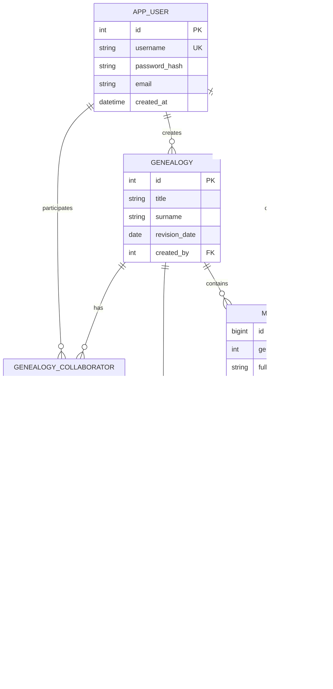

# 「寻根溯源」概念 / 逻辑设计与范式说明

## 1. ER 图（Mermaid）

### 联系类型说明

| 联系 | 基数 | 说明 |
|------|------|------|
| 用户 — 族谱（创建） | 1 : N | 一用户可创建多本族谱 |
| 用户 — 族谱（协作） | M : N | 通过 `genealogy_collaborator` 分解 |
| 族谱 — 成员 | 1 : N | 一本族谱多名成员 |
| 成员 — 成员（父/母） | N : 1 | 每名成员至多一个父亲、一个母亲（可为空） |
| 成员 — 婚配 | M : N | 通过 `marriage` 关联双方 |

## 2. 关系模式（逻辑结构）

- `app_user(id, username, password_hash, email, created_at)`
- `genealogy(id, title, surname, revision_date, created_by)`
- `genealogy_collaborator(genealogy_id, user_id, invited_by, joined_at)` — 复合主键 `(genealogy_id, user_id)`
- `member(id, genealogy_id, full_name, gender, birth_year, death_year, biography, father_id, mother_id, generation_no, created_by, created_at)`
- `marriage(id, genealogy_id, husband_id, wife_id, married_year)`

## 3. 范式级别（说明）

- **1NF**：属性原子；多值协作、婚配已拆成独立表。
- **2NF**：无部分依赖；协作表主键为两列组合，非主属性完全依赖于组合键。
- **3NF**：族谱属性仅依赖于 `genealogy.id`；成员属性依赖于 `member.id`；用户名仅依赖于 `app_user.id`。不存在非主属性对非主属性的传递依赖（如把「姓氏」冗余到成员而不依赖族谱时才会破坏，本设计将「谱级姓氏」放在 `genealogy`，成员姓名独立存储，避免传递依赖）。
- **BCNF**：在不存在主属性对非超键的决定关系前提下，一般函数依赖左侧均为超键；婚配表中 `(husband_id, wife_id)` 唯一，与业务键一致。

跨行业务规则（父母出生年早于子女、父母性别等）由 **CHECK（单行）+ 触发器（跨行）** 实现，见 `sql/01_schema.sql`。

## 4. 主键、外键与 CHECK

- 各表主键、外键定义见 `sql/01_schema.sql`。
- 单行 CHECK：`gender`、`birth_year`/`death_year` 范围、婚配双方不同等。
- 触发器：`trg_member_parent_checks`（同谱、性别、父母出生早于子女）；`trg_marriage_same_genealogy`（婚配双方族谱一致）。
